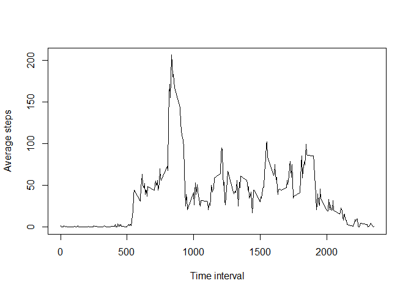
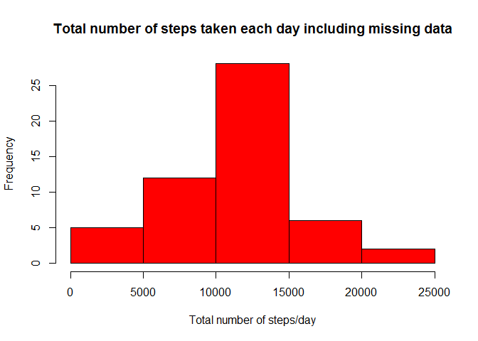
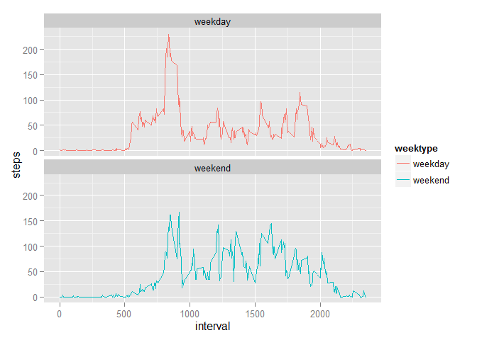

# **Project Assessment 1: Reproducible Research**
Charmaine Hough  
20th December 2015  


##Set the markdown file to show all code and output

```r
library(knitr)
opts_chunk$set(echo = TRUE)
```


##Set working directory
### Note to user: set this to your own working directory which contains the file activity.csv

```r
setwd("C:\\Users\\ctam0304.MCS\\Desktop\\datasciencecoursera\\5.ReproducibleResearch\\PeerAssessment1")
```


##Load in the necessary packages

```r
library(tidyr)
library(dplyr)
```

```
## 
## Attaching package: 'dplyr'
## 
## The following objects are masked from 'package:stats':
## 
##     filter, lag
## 
## The following objects are masked from 'package:base':
## 
##     intersect, setdiff, setequal, union
```

```r
library(ggplot2)
```

```
## Warning: package 'ggplot2' was built under R version 3.2.3
```


##Loading and preprocessing the data

```r
activity <- read.csv("activity.csv",header=TRUE)
activity$date <- as.Date(activity$date,format="%Y-%m-%d")
activity$steps <- as.numeric(activity$steps)
activity$interval <- as.numeric(activity$interval)
```


##What is the mean total number of steps taken per day?
###1. Calculate the total number of steps taken per day

```r
activity %>% group_by(date) %>% summarise(sum= sum(steps)) -> totalsteps
```

###2. Make a histogram of the total number of steps taken each day

```r
hist(totalsteps$sum,
     main= paste("Total number of steps taken each day"),
     xlab = "Total number of steps/day",
     col="red")
```

 

###3. Calculate and report the mean and median of the total number of steps taken per day

```r
totalsteps %>% 
  summarise(avg=round(mean(sum,na.rm=TRUE)), 
            median=median(sum, na.rm=TRUE))
```

```
## Source: local data frame [1 x 2]
## 
##     avg median
##   (dbl)  (dbl)
## 1 10766  10765
```


##What is the average daily activity pattern?
###1. Make a time series plot of the 5-minute interval and the average number of steps taken, averaged across all days

```r
activity %>% group_by(interval) %>% summarise(avg=round(mean(steps,na.rm=TRUE))) ->meansteps

plot(meansteps$interval,meansteps$avg,
     type="l",
     col="black",
     xlab="Time interval",
     ylab="Average steps")
```

 

###2. Calculate which 5-minute interval, on average across all the days in the dataset, contains the maximum number of steps

```r
summarise(meansteps,maximum=max(avg))
```

```
## Source: local data frame [1 x 1]
## 
##   maximum
##     (dbl)
## 1     206
```

```r
which(meansteps$avg=="206") ->ind
meansteps[ind,]
```

```
## Source: local data frame [1 x 2]
## 
##   interval   avg
##      (dbl) (dbl)
## 1      835   206
```
####The interval with the maximum number of steps is 835


##Imputing missing values
###1. Calculate and report the total number of missing values in the dataset

```r
activity %>% filter(is.na(steps)) %>% count()
```

```
## Source: local data frame [1 x 1]
## 
##       n
##   (int)
## 1  2304
```

###2. Devise a strategy for filling in all of the missing values in the dataset

```r
activity_complete <- activity
nas <- is.na(activity_complete$steps)
avg_interval <- tapply(activity_complete$steps, 
                       activity_complete$interval, 
                       mean, 
                       na.rm=TRUE, 
                       simplify=TRUE)
avg_interval <- round(avg_interval,digits=0)
activity_complete$steps[nas] <- avg_interval[as.character(activity_complete$interval[nas])]
```

###3. Checking that there are no more nas 

```r
sum(is.na(activity_complete$steps))
```

```
## [1] 0
```


###4.Make a histogram of the total number of steps taken each day

```r
activity_complete %>% group_by(date) %>% summarise(sum= sum(steps)) -> completetotalsteps

hist(totalsteps$sum,
     main= paste("Total number of steps taken each day including missing data"),
     xlab = "Total number of steps/day",
     col="red")
```

 

###5. Calculate and report the mean and median total number of steps taken per day 

```r
completetotalsteps %>% 
  summarise(avg=round(mean(sum,na.rm=TRUE)), 
            median=median(sum, na.rm=TRUE))
```

```
## Source: local data frame [1 x 2]
## 
##     avg median
##   (dbl)  (dbl)
## 1 10766  10762
```

###6. What is the impact of imputing missing data on the estimates of the total daily number of steps?
####Using the average steps/interval for imputing missing data has no impact on the calculated average and median


##Are there differences in activity patterns between weekdays and weekends?
###1. First, create a new factor variable in the dataset with two levels - "weekday" and "weekend"

```r
activity_complete <- mutate(activity_complete, 
                            weektype = 
                              ifelse(weekdays(activity_complete$date) == "Saturday" |                               weekdays(activity_complete$date) == "Sunday", 
                                "weekend", "weekday"))
activity_complete$weektype <- as.factor(activity_complete$weektype)
```
###2. Work out average total number of steps for weekdays or weekends

```r
activity_complete %>% group_by(interval,weektype) %>% 
summarise(avg=round(mean(steps,na.rm=TRUE))) ->meansteps_weektype
```

###3. Make a panel plot containing a time series plot of the 5-minute interval and the average number of steps taken, averaged across all weekday days or weekend days 

```r
plot <- ggplot(meansteps_weektype, aes(x=interval, y=avg, colour=weektype)) +
        geom_line() +
        facet_wrap(~weektype, ncol = 1, nrow=2) +
        ylab("steps")

print(plot)
```

 


